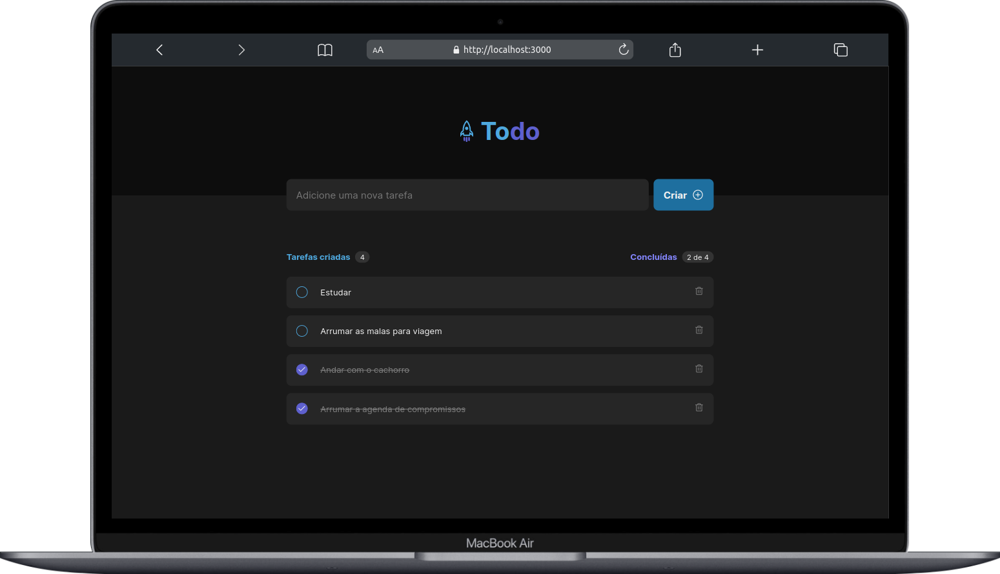
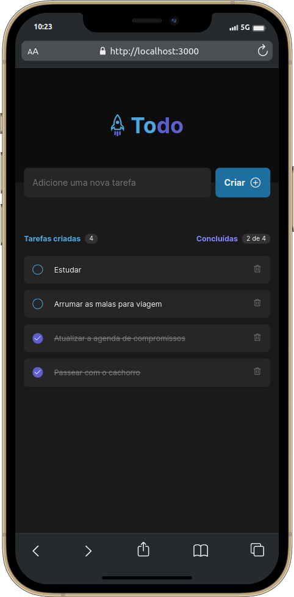

<h1 align="center">ToDo List</h1>

	🚀Completed project 🚀

  <a href="#-application-video">Application video</a>&nbsp;&nbsp;&nbsp;|&nbsp;&nbsp;&nbsp;
  <a href="#-technologies">Technologies</a>&nbsp;&nbsp;&nbsp;|&nbsp;&nbsp;&nbsp;
  <a href="#-project">Project</a>&nbsp;&nbsp;&nbsp;|&nbsp;&nbsp;&nbsp;
  <a href="#-layout">Layout</a>&nbsp;&nbsp;&nbsp;|&nbsp;&nbsp;&nbsp;
  <a href="#-Author">Author</a>&nbsp;&nbsp;&nbsp;|&nbsp;&nbsp;&nbsp;
  <a href="#-License">License</a>

  

  &nbsp;&nbsp;
  &nbsp;&nbsp;
  

 

<h2>
   💻 desktop
</h2>

&nbsp;

  

&nbsp;

<h2>
   📱 Mobile
</h2>

&nbsp;

  

&nbsp;

<h2>
  🎥 Application video
</h2>

&nbsp;

https://github.com/Daniel-Guimaraes/ToDo-List/assets/102679381/2e7a5f10-9b93-4231-96d3-4939e906a623

&nbsp;

## 🚀 Technologies and Frameworks 
This project was developed with the following technologies:

- HTML e [CSS Modules](https://github.com/css-modules/css-modules)
- [React](https://react.dev/)
- [Vite](https://vitejs.dev/)

 

## 💻 Project
ToDo List is a to-do list-style task tracking application that contains the following features:

- Add a new task;
- Marking and Unmarking a Task Completed;
- Remove a task from the list;
- Show task completion progress;

To access the website [Click here](https://tasks-list-to-do.netlify.app/)

 

## 🔖 Layout
You can view the project layout through [FROM THIS LINK](https://www.figma.com/file/OfuxQhOjKwKVC1viO9VINb/ToDo-List-%E2%80%A2-Desafio-React-(Copy)?type=design&node-id=4130%3A491&mode=dev). You must have an account with [Figma](https://figma.com) to access it.

 

## 👨‍💻 Author

<a href="https://www.linkedin.com/in/daniel-guimaraes-vieira/">
 
  
 <b>Daniel Guimarães</b></a> <a href="https://www.linkedin.com/in/daniel-guimaraes-vieira/" title="Author Daniel">🚀</a>
  

 

## 📝 License

This project is under license [MIT](./LICENSE).

---

Made with ❤️ by Daniel Guimarães 👋🏽 [Get in touch!](https://www.linkedin.com/in/daniel-guimaraes-vieira/)
